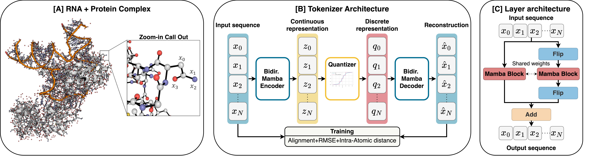
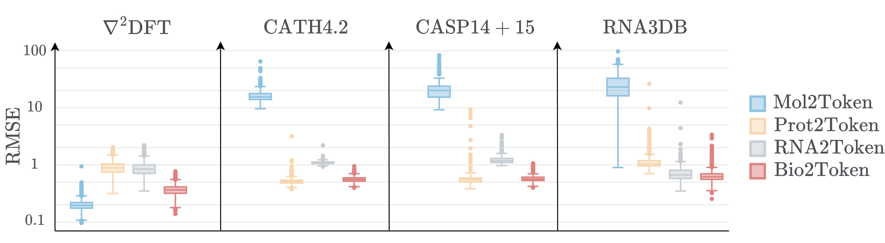

# Bio2Token: Deep Learning Autoencoder for Biological Tokenization

Bio2Token is a deep learning-based autoencoder designed for quantizing any biological structures into a discrete token format. This is the official repository of the paper [Bio2Token: All-atom tokenization of any biomolecular structure with Mamba](https://arxiv.org/abs/2410.19110).


## Table of Contents

1. [Setup Guide](#setup-guide)
2. [MLflow Server](#mlflow-server)
3. [Model Architecture](#model-architecture)
4. [Datasets](#datasets)
5. [Training](#training)
6. [Testing](#testing)
7. [Testing on Raw PDB Files](#testing-on-raw-pdb-files)
8. [License](#license)

## Setup Guide

To manage environments efficiently, we use [uv](https://docs.astral.sh/uv/getting-started/installation/#standalone-installer). It simplifies managing dependencies and executing scripts.

- Install `uv` and synchronize your environment:
    ```bash
    pip install uv
    uv sync
    ```

## MLflow Server

We utilize [MLflow](https://mlflow.org/docs/latest/getting-started/intro-quickstart) for tracking model metrics, experiments, and parameters. To start the MLflow server, use the command below and access the monitoring interface at [http://localhost:8080](http://localhost:8080):

```bash
mlflow server --host 127.0.0.1 --port 8080
```

Update the MLflow server configuration as needed in `configs/trainer.yaml`:
```yaml
mlflow:
  experiment_name: bio2token
  tracking_server_host: 127.0.0.1
  tracking_server_port: 8080
```

## Model Architecture

The autoencoder consists of Mamba layers and a FSQ quantizer layer. The model implementation can be found in `src/bio2token/models/autoencoder.py`. You can customize the model configuration via `configs/model.yaml`. Both RMSD and Inter-Atom Distance are used as loss functions, with TM-score available for monitoring performance.



## Datasets

We provide pre-processed datasets in the `data/` folder, including:

- [CATH dataset](http://download.cathdb.info/cath/releases/all-releases/v4_3_0/non-redundant-data-sets/)
- [CASP 14](https://predictioncenter.org/casp14/targetlist.cgi) and [15 datasets](https://predictioncenter.org/casp15/targetlist.cgi) (testing only)
- [NablaDFT dataset](https://github.com/AIRI-Institute/nablaDFT)
- [RNA3DB dataset](https://github.com/marcellszi/rna3db)

Adjust data configurations using `configs/data.yaml`. Pre-processed AlphaFoldDB data is also available upon request.
```
data:
  ds_name: [cath, nabladft, rna3db]
  ds_name_val: cath
  batch_size_per_gpu: 8
  batch_size_per_gpu_val: 8
  num_workers: 4
  dataset:
    cath:
      train_split: train
      val_split: validation
      max_length: 4096
    nabladft:
      train_split: train_100k
      max_data: 10000
    rna3db:
      train_split: train_set
      max_length: 4096
      max_data: 10000
```
## Training

Train the Bio2Token model with the following command:
```bash
uv run scripts/train.py --config train.yaml
```
Configuration details are available in `configs/train.yaml`, which imports `model.yaml`, `data.yaml`, and `trainer.yaml`. The model weights are saved under `checkpoints/${experiment_name}/${run_id}`.


## Testing

To test the model on a pre-processed dataset, use:
```bash
uv run scripts/test.py --config test.yaml
```
Configure the dataset and model weights in `configs/test.yaml`:
```yaml
infer:
  experiment_name: bio2token
  run_id: bio2token_pretrained
data:
  ds_name: rna3db
```
Results are saved under `results/${experiment_name}/${run_id}/${checkpoint_name}/${ds_name}/${split_name}/test_outputs.parquet`.



## Testing on Raw PDB Files

Test on raw PDB files using:
```bash
uv run scripts/test_pdb.py --config test_pdb.yaml
```
Specify the PDB file and model weights in `configs/test_pdb.yaml`:
```yaml
infer:
  experiment_name: bio2token
  run_id: bio2token_pretrained
data:
  ds_name: examples/pdbs/107l.pdb
```

Results are saved under `results/pdb/${pdb_id}/${run_id}/${checkpoint_name}/`. The ground-truth and reconstructed structures as well as the losses and estimated tokens are saved as `gt.pdb`, `rec.pdb`, and `outputs.json`.


## License

This project is licensed under the MIT license. See [LICENSE](LICENSE.txt) for more details.
